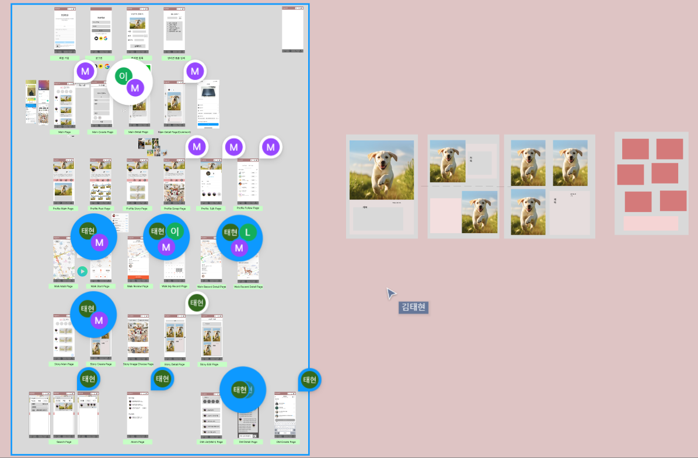
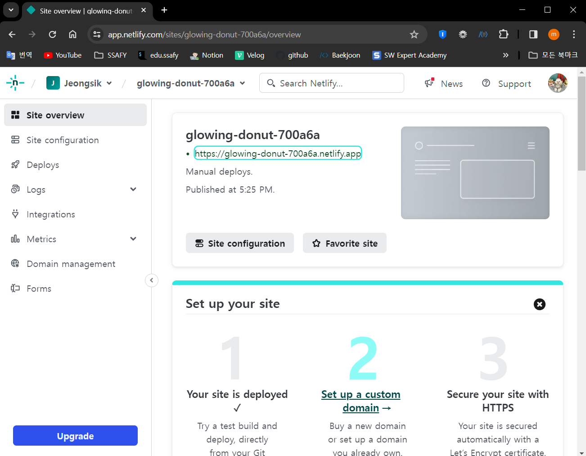

# week - 2 기록

## day - 1

### Figma 페이지 설계, API 설계, 프로젝트 명세 설계 등 프로젝트 기획 단계에서 해야할 부분들을 마무리 하고 각자 파트별로 1주일동안 해야할 일을 정했습니다. 추가로 프로젝트 결과물에 있어서 모바일 웹 상으로 이미지 업로드가 가능한지 확인이 필요했기 때문에 React로 이미지 업로드를 하는 미니 프로젝트를 구현하여 Netlify 서버에 배포한 후 모바일 웹으로도 이미지 업로드가 가능한 것을 확인했습니다.

## - 24.01.26

#### 발표 자료 준비 및 다음 주 개발 계획 정리
#### 프론트엔드 파트 재분배 및 리액트 -> 리액트 네이티브 전환 준비