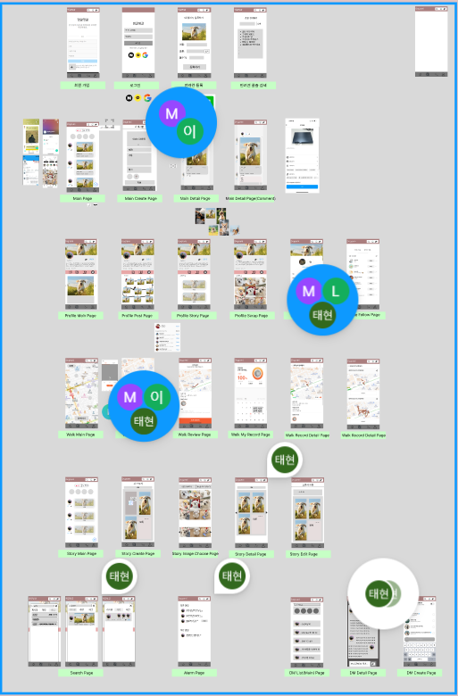
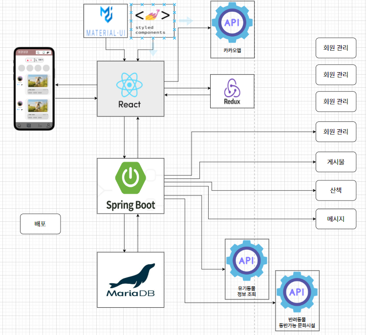
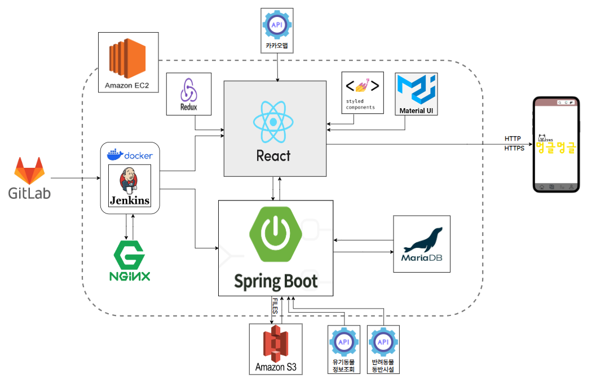

# Sub PJT II

## 2주차[2024. 01. 15(월) ~ 2024. 1. 26(금)]

### 6일차[2024. 01. 15(월)]

#### 일정관리 및 설계서 정리
- Jira 일정 설정 2주차 스프린트 시작
- 화면 설계서 정리 완료
  - 
- 아키텍처 설계 진행중
  - 

### 7일차[2024. 01. 15(화)]

#### 아키텍처 설계 보완 및 팀 미팅 피드백 정리, Jira 일정관리 정리
- 아키텍처 설계 보완
  - 
- 팀 미팅 피드백 정리
  1. 지라를 통해서 전체적인 일정을 잡고 시작하기
  2. API URI 네이밍 컨벤션 찾아보고 정해서 명세를 만들기
  3. 회원가입이나 위치정보제공 관련 법적 문제체크해보고
  4. 스토리에 대한 자동화를 어떻게 할 것인지 우리의 알고리즘으로 추천해보기 (구글포토 참조)
  5. 화면 구성에 대해서 정보들을 어떻게 보여지게 할 것인지에 대해서는 기능을 구성하면서 얘기해보기
- Jira 일정관리 정리
  - 2/9(금) - 5주차 금요일까지 완성 목표
  - 세부적인 일정은 백/프론트로 나눠서 정리하고 프론트에서 전체적인 세팅이 완료되면 백에서 완료된 데이터를 토대로 페이지 구성하기
    - 백은 우선순위를 고려하여 개발